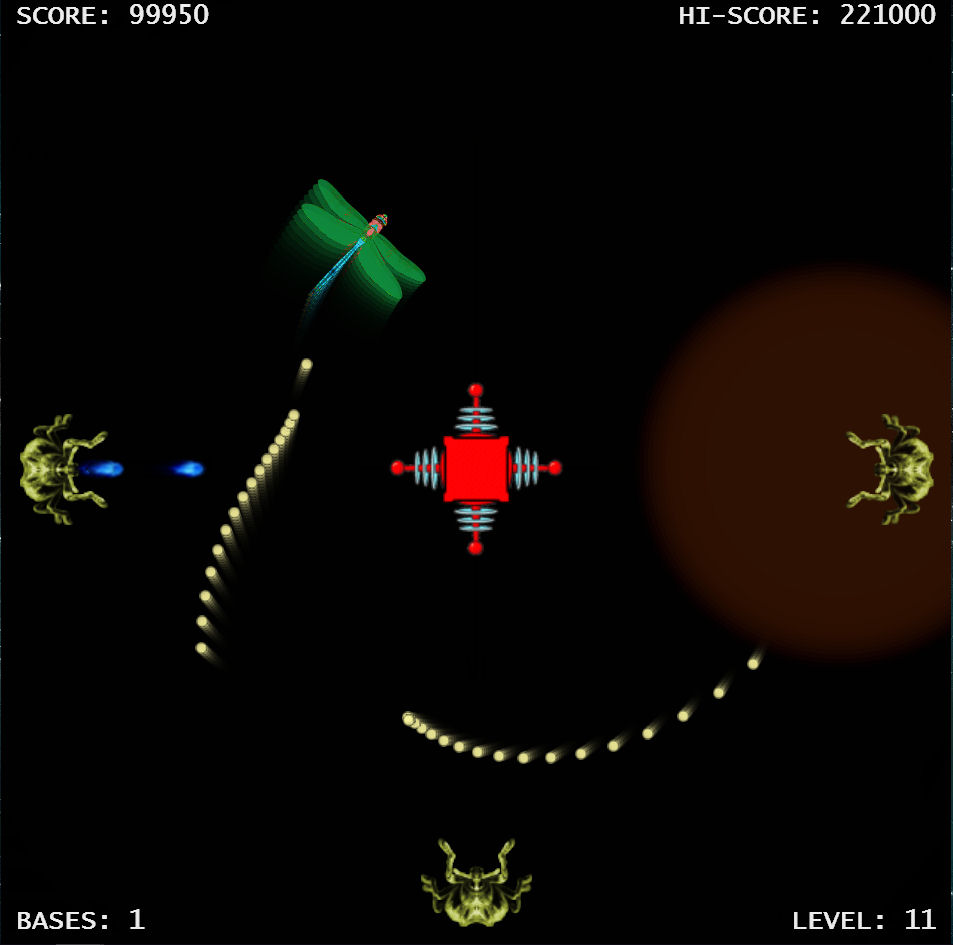

# BUG BLATTER #

A simple, fun arcade-style game (reminiscent of "Space Zap") written in React, using the HTML5 canvas element.

## Controls: 

use **arrow keys** (up, down, left, right) to fire lasers, 

(or **mouse-click**, or **tap** for mobiles)

**P** to Pause 

## to-do:

* [ ] artwork needs an overhaul (Calling all graphic designers - I need your help !)

* [ ] more levels

* [ ] reactnative implementation (maybe embed into webview component ? )

* [ ] rotating / moving base

* [ ] power-ups ?

* [ ] customisable / assignable keys

* [ ] improve playability on tiny screens (eg iPhone 4s)

